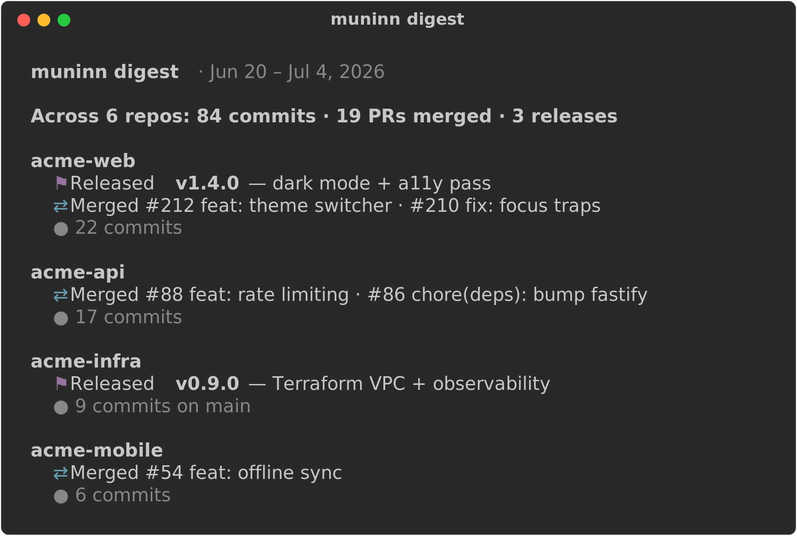

# muninn

Memory for your GitHub estate — what you shipped, and when.

<p align="center">
  
</p>

In Norse myth Odin keeps two ravens: **Huginn** (*thought*) and **Muninn** (*memory*). They fly the
world and report back what they see. [`huginn`](https://github.com/brett-buskirk/huginn) is Muninn's
sibling — a stateless, present-tense CLI that reports what your estate looks like *right now*: current
branches, dirty trees, open PRs, convention drift.

**Muninn is memory.** It answers the questions huginn structurally can't: what happened across your
repos this week, what you've actually shipped, and a written summary of it you can hand a client or
drop in a work-log. Muninn is a **read-only archivist** — everything is derived from git history and
the GitHub API. No stored state, no database.

> Built as huginn's twin — same language, same look, same conventions. See the
> [Roadmap](ROADMAP.md) for what's next (the one place Muninn *would* store its own memory: a
> decision log).

## Install

Requirements: `bash`, `git`, [`gh`](https://cli.github.com) (authenticated), `jq`.

```bash
git clone git@github.com:brett-buskirk/muninn.git ~/github-repos/muninn
ln -s ~/github-repos/muninn/muninn ~/.local/bin/muninn   # ~/.local/bin must be on your PATH
muninn init                                              # write a config with detected defaults
```

`muninn` manages the repos in **`$MUNINN_ROOT`** (default `~/github-repos`).

> Already run `huginn init`? Muninn falls back to `~/.config/huginn/config`'s `HUGINN_ROOT` /
> `HUGINN_OWNER` / `HUGINN_FAMILY` when its own `MUNINN_*` config is unset — a huginn user gets a
> working muninn with zero setup.

## Commands

```
remember
  log [--since <window>] [repo]      activity timeline — PRs, releases, commits
  releases                           every tag/release across the estate
  digest [--since <window>] [--md]   a written summary of what shipped
configure
  init [--force]                     write a muninn config with detected defaults
  help                               this menu
```

Run **`muninn <command> help`** for details and options on any command. For a one-page reference to
every command, option, and behavior, see the [**cheat sheet**](CHEATSHEET.md).

## How it works

- **Derive, don't store** — every command is computed fresh from `git log`/tags (local, fast) and the
  GitHub API via `gh` (network, only where noted). No database, no cache.
- **One estate-wide PR search, per-repo release lookups** — `gh search prs` covers merged PRs across
  the whole estate in a single call; there's no equivalent estate-wide release search, so `releases`,
  `log`, and `digest` each look up releases per repo (the same cost class as huginn's `doctor`).
- **Busy repos collapse** — `log` collapses a repo's commit run to a count above 5; `digest` collapses
  a repo's merged-PR list to a count above 8. Neither command lets one prolific repo drown the rest.
- **Respects `NO_COLOR`** and non-TTY output.

## Configuration

Settings resolve **environment variable → config file → smart default**. Run `muninn init` to write a
config with detected defaults, then edit it. Config file:
`${XDG_CONFIG_HOME:-~/.config}/muninn/config` (override with `MUNINN_CONFIG`).

| Key / env var | Default | Purpose |
|---|---|---|
| `MUNINN_OWNER` | your `gh` login (or huginn's) | GitHub owner of the estate repos |
| `MUNINN_ROOT` | `~/github-repos` (or huginn's) | directory of repos to manage |
| `MUNINN_FAMILY` | _(none, or huginn's)_ | space-separated repos to exclude |
| `MUNINN_SINCE` | `1w` | default `--since` window for `log`/`digest` |

If `~/.config/huginn/config` exists and the matching `MUNINN_*` value is unset, muninn falls back to
huginn's `HUGINN_ROOT`/`HUGINN_OWNER`/`HUGINN_FAMILY`.

## License

[MIT](LICENSE) © 2026 Brett Buskirk
